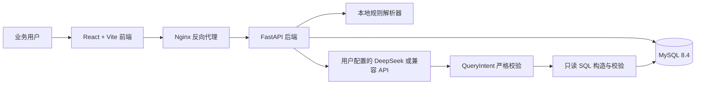

# 智能 BI 数据洞察与报告生成平台答辩材料

## 一、项目定位

本项目面向中小企业经营分析场景，将销售订单数据、指标监控、自然语言查询、经营报告、异常归因和趋势预测整合为一套可本地运行的 BI 平台。答辩时应强调：它不是只展示页面的原型，而是带有 MySQL 数据库、FastAPI 后端、React 前端、可配置 AI 服务和自动化测试的完整系统。

项目名称：**智能 BI 数据洞察与报告生成平台**

核心用户：需要快速查看经营数据、按区域和产品下钻、生成月报并提出分析问题的业务人员。

## 二、要解决的问题

传统 Excel 分析需要人工筛选、写公式、制作图表和整理汇报。业务人员提出“本月各区域销售额排名如何”后，往往还要在多个文件中来回操作。本系统提供统一入口：

1. 将 540 条内置销售订单沉淀到 MySQL。
2. 通过仪表盘和筛选器完成常规经营监控。
3. 用自然语言把问题转换为受控查询意图，再由后端生成只读 SQL。
4. 自动汇总为图表、明细、CSV 和 Markdown 报告。
5. 对异常和趋势给出有边界的辅助分析。

## 三、系统架构

运行方式：Docker Compose 负责 MySQL、后端和 Nginx 前端；双击 `启动智能BI系统.cmd` 即可启动。

## 四、系统特色与创新点

### 1. 自然语言不是直接执行 SQL

系统先把问题约束成 `QueryIntent`：指标、聚合、维度、时间范围、筛选、排序和分析类型均有白名单。后端再根据这个意图构造 SQL，并经过只读校验。因此大模型不会直接获得数据库执行权，避免“模型输出一段 SQL 就直接执行”的常见风险。

### 2. 没有 API Key 也能完整演示

默认使用本地规则引擎，可稳定完成仪表盘、查询、报告、异常和预测演示。外部 AI 超时、鉴权失败或返回不合规时，查询自动回退到本地规则并提示原因，演示不会因为网络或模型服务中断而失败。

### 3. DeepSeek 接入降低配置门槛

系统配置页默认选择 **DeepSeek API**。用户只填 API Key，系统自动使用官方地址、默认模型、60 秒超时和公网安全策略；需要其他服务时才切换到“其他 OpenAI 兼容服务”并填写完整字段。

针对真实模型输出，后端要求 JSON 输出模式，并兼容 DeepSeek 可能出现的思考标签和 JSON 代码块；最终仍通过 Pydantic 严格校验。官方 DeepSeek 域名会强制禁用私有网络访问，即使旧配置曾勾选该选项也不会放宽网络边界。

### 4. 数据分析与报告产物可交付

查询结果提供图表、明细和 CSV 导出；报告支持模块选择、预览和 Markdown 导出。异常页面明确说明“预警不是自动定因”，趋势预测明确标注 OLS 线性回归仅用于辅助决策，避免把分析结果表述为业务承诺。

### 5. 安全与可运维性可说明

- API Key 使用 Fernet 加密保存，接口只返回脱敏提示。
- 外部 API 地址限制为 HTTP/HTTPS，DNS 解析、重定向和响应大小均受控。
- 私有网络访问需要显式选择；DeepSeek 官方端点强制使用公网安全策略。
- Docker 端口只绑定本机回环地址；测试使用隔离 Compose 项目、独立数据库卷和 Mock LLM。

## 五、六分钟答辩演示流程

| 时间 | 操作 | 要点 |
| --- | --- | --- |
| 0:00-0:40 | 打开仪表盘，选择“华东”后再清空筛选 | 展示 540 条订单、KPI 和多维下钻。 |
| 0:40-1:50 | 在智能查询点击“本月各区域销售额排名如何？” | 展示自然语言、受控意图、只读 SQL、图表、表格和 CSV。 |
| 1:50-2:35 | 输入“上月华东区销售额最高的产品是什么？” | 展示自定义问题和查询历史。 |
| 2:35-3:20 | 打开报告生成，生成月报并导出 Markdown | 展示报告模块化与可交付产物。 |
| 3:20-4:10 | 打开异常归因和趋势预测 | 强调阈值预警、证据和预测边界。 |
| 4:10-5:20 | 打开系统配置 | 选择 DeepSeek API，只显示 Key 输入；说明其他兼容服务的完整配置入口。 |
| 5:20-6:00 | 总结安全边界与回退策略 | 强调 AI 只解析意图、SQL 只读校验、失败可回退。 |

详细逐字稿见 [演示讲稿](demo/演示讲稿.md)，输入问题清单见 [演示问题清单](demo/演示问题清单.md)。

## 六、建议展示的验证证据

1. `http://localhost:8080/api/health` 返回应用、数据库和订单数据状态。
2. DeepSeek 连接测试返回服务名称、模型和耗时，不返回 API Key。
3. 后端自动化测试覆盖 AI 配置、意图校验、SSRF 防护、SQL 只读校验和回退逻辑。
4. 前端单元测试验证 API 处理、格式化、导出和安全展示；生产构建通过 Vite。
5. GitHub 仓库包含启动器、演示文档、素材和测试脚本，其他人可按 README 复现。

## 七、常见答辩问题与回答

### 为什么不让大模型直接生成并执行 SQL？

因为自然语言模型输出不稳定，也可能受到提示注入影响。系统要求模型只返回严格的查询意图，由后端白名单映射为 SQL，并在执行前检查只读语句和参数，这样数据访问权仍在系统后端。

### DeepSeek 接入失败时系统还能使用吗？

可以。仪表盘、异常、预测和报告基础内容不依赖外部模型；查询和报告叙述在外部 AI 不可用时会回退本地规则或本地内容，并把原因显示给用户。

### 系统数据从哪里来？

当前版本使用内置的 540 条销售订单，覆盖多个区域、产品和月份，便于稳定复现。实际落地时可增加 Excel/ERP 接口或数据仓库同步层，保持查询意图、SQL 安全层和前端交互不变。

### 预测结论能直接用于经营决策吗？

不能直接作为承诺。本系统使用 OLS 线性回归作为趋势辅助，并在界面说明其局限；真实业务还需要加入节假日、促销、库存、渠道等变量并进行回测。

### 这个项目与普通 BI 看板有什么不同？

普通看板主要是固定指标展示。本系统在稳定看板的基础上加入了自然语言提问、受控 Text-to-SQL、AI 叙述、异常归因、趋势预测、报告导出以及用户自有 AI 服务接入，同时保留本地规则回退和安全边界。
