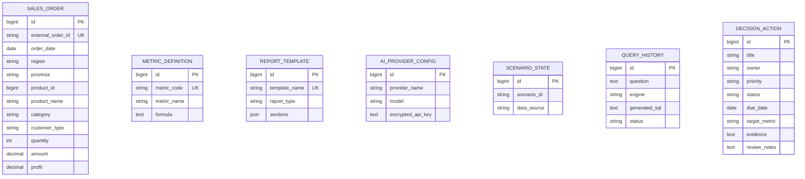

# 数据库与数据字典

## 1. 数据模型总览

系统以统一的业务明细表 `sales_order` 为分析事实表，并以指标、报告模板、AI 配置、场景状态和查询历史作为辅助表。采用统一字段不是为了限制行业，而是让电商、医院、银行、制造业和互联网公司的演示数据都能复用稳定的查询、趋势、异常和报告能力。



## 2. 核心事实表：`sales_order`

| 数据库字段 | CSV 字段 | 类型 | 含义 | 行业映射示例 |
| --- | --- | --- | --- | --- |
| `external_order_id` | `record_id` | varchar(40) | 唯一业务记录编号 | 订单号、服务单号、业务流水号。 |
| `order_date` | `date` | date | 发生日期 | 交易日、就诊日、办理日、交付日、订阅日。 |
| `region` | `region` | varchar(20) | 一级组织/区域 | 区域、院区、分行、工厂、业务组。 |
| `province` | `province` | varchar(40) | 城市或二级位置 | 省份、城市、所在地。 |
| `product_id` | `item_id` | bigint | 分析对象编号 | 商品、医疗服务、金融产品、产品、订阅产品。 |
| `product_name` | `item_name` | varchar(120) | 分析对象名称 | 同上。 |
| `category` | `category` | varchar(40) | 分类/业务线 | 品类、科室、业务条线、产品线、业务线。 |
| `customer_type` | `customer_type` | varchar(40) | 对象类型 | 用户类型、患者类型、客户分层、客户类型。 |
| `quantity` | `quantity` | int | 数量指标 | 件数、人次、办理笔数、交付数量、付费席位。 |
| `amount` | `amount` | decimal(14,2) | 金额指标 | GMV、服务收入、业务收入、订单产值、订阅收入。 |
| `profit` | `profit` | decimal(14,2) | 收益指标 | 毛利、贡献收益或按业务口径计算的收益。 |

数据库还保存自增主键 `id` 和创建时间 `created_at`。查询性能通过“日期 + 区域”和“类别 + 对象类型”组合索引改善。

## 3. 指标字典：`metric_definition`

| 指标 | 指标代码 | 计算公式 | 说明 |
| --- | --- | --- | --- |
| 销售额/经营金额 | `sales_amount` | `SUM(amount)` | 在行业场景中显示为 GMV、服务收入等。 |
| 销售数量 | `quantity` | `SUM(quantity)` | 与各场景的数量术语对应。 |
| 订单量 | `order_count` | `COUNT(*)` | 当前数据明细记录数。 |
| 客单价 | `average_order_value` | `SUM(amount) / COUNT(*)` | 单条业务记录的平均金额。 |
| 毛利 | `profit` | `SUM(profit)` | 当前口径下的收益总和。 |
| 毛利率 | 派生指标 | `SUM(profit) / SUM(amount)` | 前端按实时金额和收益计算。 |

## 4. 其他业务表

| 表 | 关键字段 | 用途 |
| --- | --- | --- |
| `report_template` | `template_name`、`report_type`、`sections` | 保存周报、月报和自定义报告的模块顺序。 |
| `ai_provider_config` | `provider_name`、`base_url`、`model`、`encrypted_api_key` | 保存用户自有 AI 配置；密钥只保存加密值和脱敏提示。 |
| `scenario_state` | `scenario_id`、`data_source` | 记录当前激活的行业场景或自有数据来源。 |
| `query_history` | `question`、`engine`、`summary`、`status`、`duration_ms` | 保存查询审计摘要；前端不会读取 SQL 或请求参数。 |
| `decision_action` | `title`、`owner`、`priority`、`status`、`due_date`、`target_metric`、`evidence`、`review_notes` | 保存人工确认的行动项和复盘结果；关闭前必须记录 `review_notes`。 |

## 5. 行业场景与数据口径

| 场景 | 金额字段的展示名称 | 数量字段的展示名称 | 核心维度 |
| --- | --- | --- | --- |
| 电商经营 | GMV / 交易额 | 件数 | 区域、商品品类、用户类型。 |
| 医院运营 | 服务收入 | 服务人次 | 院区、科室/中心、患者类型。 |
| 银行经营 | 业务收入 | 办理笔数 | 分行、业务条线、客户分层。 |
| 制造业经营 | 订单产值 | 交付数量 | 工厂、产品线、客户类型。 |
| 互联网公司经营 | 订阅收入 | 付费席位 | 业务组、业务线、客户分层。 |

每个场景提供四类模板问题：“发生了什么、为什么发生、接下来怎么办、预测与模拟”。模板与已定义的查询意图绑定，避免导入自有数据后因字段含义不明确而生成不可靠结论。

## 6. CSV 导入约束

CSV 必须包含且按模板含义填写下列 11 列：

```text
record_id,date,region,province,item_id,item_name,category,customer_type,quantity,amount,profit
```

- `record_id` 必须唯一；日期、数量、金额和收益必须可解析。
- 先使用场景库的“检查数据质量”进行只读预检，确认有效行数、时间覆盖、维度覆盖与提示后，才可确认导入。
- 导入、加载演示数据都会替换当前数据集并清空查询历史，导入前应备份原始文件。
- 系统只对上述受控字段提供查询、报告、异常、预测和建议；未映射字段不会被猜测或直接执行。
- 使用模板文件：[字段模板.csv](demo/scenarios/字段模板.csv)。
