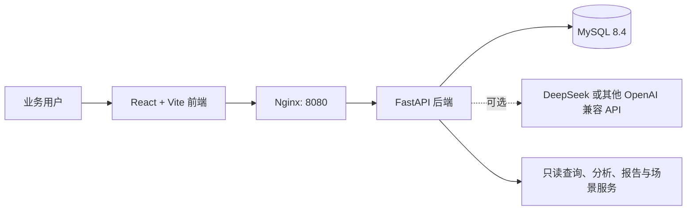

# 系统设计说明书

## 1. 设计目标

本系统把“业务人员提出问题”到“得到可核对的分析结果和行动线索”组织为一个闭环：自然语言查询、指标/图表展示、异常归因、趋势预测、报告导出与场景化数据演示均在同一工作台中完成。

设计重点是可演示、可复现和可解释：查询会展示只读 SQL、结果、图表和分析说明；可选的 AI 仅用于意图理解与叙述增强，不能绕过数据、SQL 安全或导入边界。

## 2. 总体架构

| 层次 | 技术与模块 | 主要职责 |
| --- | --- | --- |
| 表现层 | React 19、Vite、CSS 工作台 | 场景库、智能查询、仪表盘、报告、异常、预测和配置页面。 |
| 网关层 | Nginx | 提供前端静态文件，将 `/api` 代理到后端。 |
| 服务层 | FastAPI | 请求校验、业务服务编排、错误规范化、OpenAPI 文档。 |
| 分析层 | 本地解析器、SQL Builder、Analytics、Reports、Scenarios | 生成受控查询、聚合计算、归因线索、预测、报告和场景数据。 |
| 数据层 | MySQL 8.4、SQLAlchemy、Alembic | 保存订单、指标、报告模板、AI 配置、场景状态和查询历史。 |
| 外部 AI 层 | DeepSeek / OpenAI 兼容接口 | 自愿启用的自然语言意图和报告叙述增强；不可用时回退本地模式。 |

## 3. 核心业务流程

### 3.1 自然语言查询

1. 用户在顶部输入框或“智能查询”页面提交问题。
2. 后端优先加载已保存且启用的 AI 配置；没有配置、连接异常或结果不合规则使用本地解析器。
3. 解析器只识别受控的指标、维度、时间范围、排序和场景模板意图。
4. SQL Builder 生成单条参数化只读查询，并拒绝写入、删除、建表、授权及多语句。
5. 查询服务从 `sales_order` 聚合数据，返回 SQL、结构化行、摘要、推荐图表和必要的限制提示。
6. 前端呈现结论、SQL、图表、结果表；查询历史仅保留安全展示字段。

### 3.2 场景切换与自有数据导入

1. 用户在“场景库”选择电商、医院、银行、制造业或互联网公司。
2. 点击加载后，系统用对应行业的演示数据替换当前数据集，并清空旧查询历史。
3. 页面随场景切换业务术语、字段映射、根因核查项、行动建议和 17 条模板问题。
4. 导入自有数据时，系统要求 11 个标准字段、校验 CSV 内容后替换当前数据集；场景模板继续作为可解释的功能边界。

### 3.3 报告、异常与预测

- 报告服务按周报、月报或自定义报告类型组合“概览、区域、排行、异常、预测”模块，生成可预览和导出的 Markdown。
- 异常服务依据完整月度数据的变化寻找异常，并提供区域/产品等维度的核查线索，结论明确区分数据证据与建议。
- 预测服务基于历史月度金额给出下一周期的趋势参考，不承诺经营结果。

## 4. 前端模块

| 页面 | 主要能力 |
| --- | --- |
| 场景库 | 一键切换 5 个行业、展示行业字段映射、下载/导入 CSV。 |
| 智能查询 | 输入问题、选择模板、查看 SQL/图表/表格/摘要、导出 CSV、查看历史。 |
| 仪表盘 | KPI、区域/类别/客群筛选、趋势和排行。 |
| 报告生成 | 选择报告类型和模块、生成预览、导出 Markdown。 |
| 异常归因 | 展示异常证据、变化贡献和业务核查方向。 |
| 趋势预测 | 展示历史趋势、下期预测及假设分析说明。 |
| 系统配置 | 选择 DeepSeek（仅填 Key）或其他 OpenAI 兼容服务，连接测试、保存、删除。 |

## 5. 后端接口概览

| 接口 | 方法 | 用途 |
| --- | --- | --- |
| `/api/health` | GET | 返回应用、数据库、订单数与 AI 模式状态。 |
| `/api/metadata` | GET | 返回指标和维度元数据。 |
| `/api/dashboard` | GET | 返回带区域、类别、客群筛选的仪表盘数据。 |
| `/api/query` | POST | 执行受控自然语言查询。 |
| `/api/query-history` | GET | 获取按时间倒序的安全查询历史。 |
| `/api/reports/generate` | POST | 生成模块化经营报告。 |
| `/api/anomalies`、`/api/forecast` | GET | 返回异常归因与趋势预测结果。 |
| `/api/scenarios` | GET | 获取场景库与当前场景状态。 |
| `/api/scenarios/{scenario_id}/activate` | POST | 激活一个演示场景。 |
| `/api/scenarios/import/preview` | POST | 只读校验 CSV 并返回数据质量与分析覆盖度，不修改当前数据。 |
| `/api/scenarios/import` | POST | 导入符合模板的 CSV 数据。 |
| `/api/settings/ai` | GET/PUT/DELETE | 查看、保存、删除 AI 服务配置。 |
| `/api/settings/ai/test` | POST | 不保存或按当前配置测试 AI 连通性。 |

完整的可交互接口说明在系统运行后访问 [API Docs](http://localhost:8080/api/docs)。

## 6. 安全与可靠性设计

- 数据库和前端端口只绑定 `127.0.0.1`，默认不对局域网开放。
- 后端 Trusted Host 仅接受 `localhost`、`127.0.0.1` 和测试地址。
- Text-to-SQL 只执行受控、只读、单语句查询；AI 返回的意图仍需后端校验。
- API Key 不返回给浏览器，以 Fernet 加密存储；页面只显示脱敏提示。
- 外部模型地址默认采用安全网络策略，访问私网地址需要用户显式允许。
- 所有 API 响应携带 `request_id`；异常响应不回显敏感输入。
- 正常系统与自动化测试使用独立 Compose 项目和 MySQL 卷，避免测试破坏演示数据。

## 7. 当前边界与后续演进

当前版本定位为可运行的课程/实习原型：不含登录、多租户权限、生产级数据仓库和精确预测模型。后续可从 RBAC、真实数据源连接器、指标口径管理、审计、异步任务、ECharts 以及受控生产部署逐步扩展。
